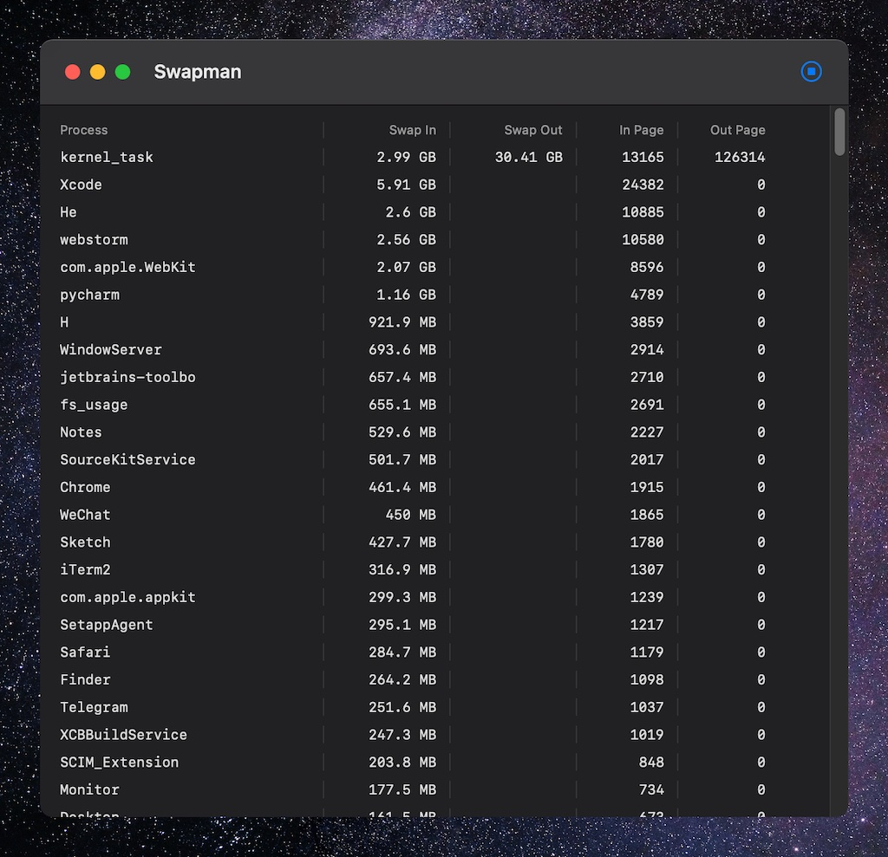
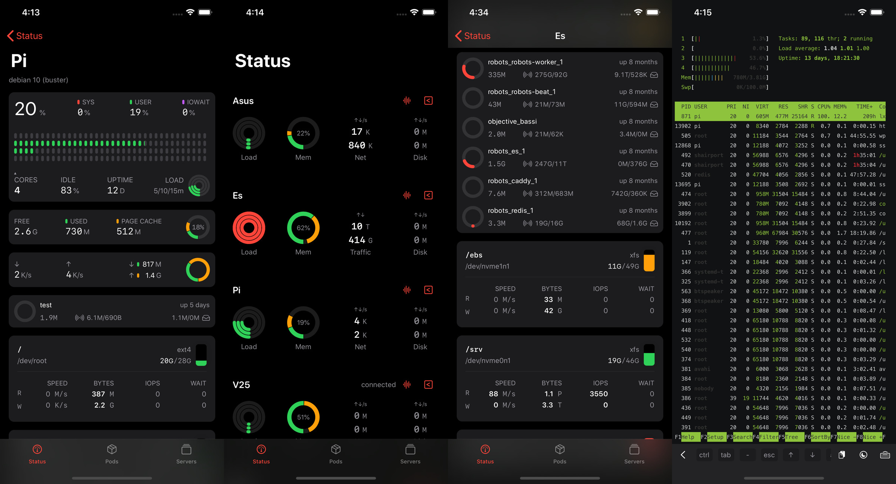

#  Swapman

Worried about M1’s SSD swap usage?  Try Swapman: a fresh open-source macOS app that monitors swap in/out ! Find out which process is using swapfile.

## USAGE

1. Download Swapman.app in Releases
2. Open Terminal
3. Run `sudo Swapman.app/Contents/MacOS/Swapman`
4. Click "Start" icon

## Sponsored by myself

**ServerCat - Server Status, Docker Management and SSH client for iOS.**

