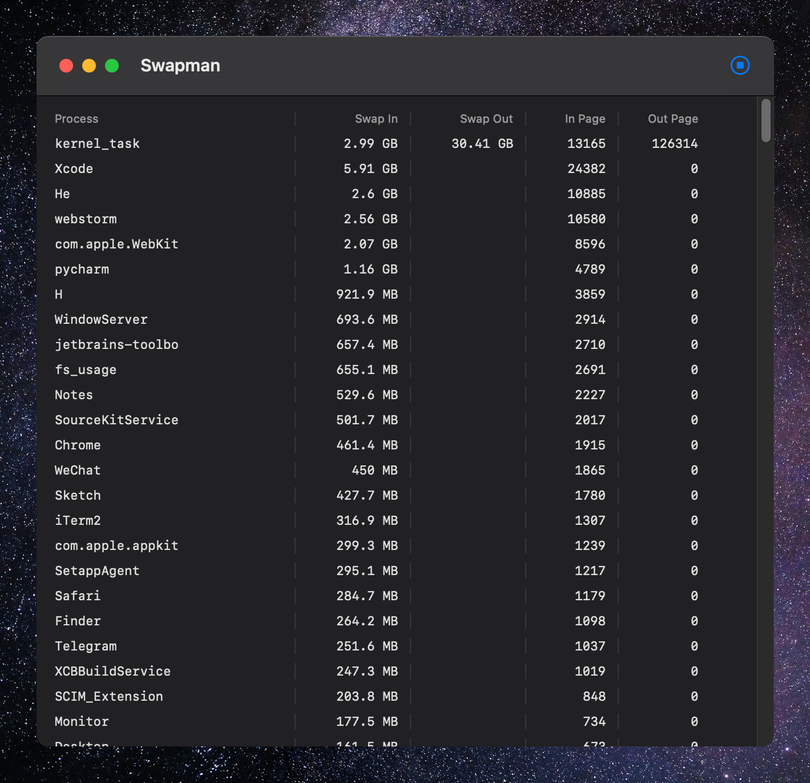

#  Swapman

Worried about M1’s SSD swap usage?  Try Swapman: a fresh open-source macOS app that monitors swap in/out ! Find out which process is using swapfile.

## USAGE

1. Download Swapman.app in releases
2. open Terminal
3. run `sudo Swapman.app/Contents/MacOS/Swapman`

